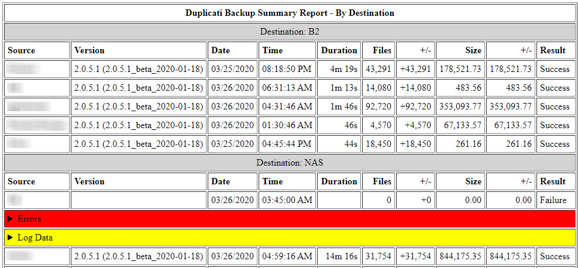

## dupReport Reporting

dupReport contains an advanced reporting engine that allows the user to define the data included in reports and arrange the layout of report sections. This is all handled by managing the configuration of .rc file options. No programming is required.

------

## [report] section

The [report] section contains the information on how reports are laid out and the default settings for reports. The following sections describe the various options that can be set in the [report] section.

------

**Defining Report Layout**

```
layout = <section> [, <section>, <section>, ...]
```

The *layout=* option defines the sections that will be present in the final report. There can be more than one section in the report, and each section must be separated by a comma. For example, to define a report with  just one section ("bydest"), set the layout option as:

> layout = bydest

To define a report with three sections ("bydest", "noactivity", and "lastseen") define the layout option as:

> layout = bydest, noactivity, lastseen

The order these sections are specified in the layout option is the order they appear in the report. So, to have the "lastseen" section shown first, define the layout option as:

> layout = lastseen, bydest, noactivity

**Pre-defined Reports**

dupReport comes with several pre-defined report formats:

**srcdest**: This prints email results grouped by Source-Destination pairs. Here is an example of the srcdest report:


**bysrc**: This prints email results grouped by Source systems. Here is an example of the bysrc report:


**bydest**: This prints email results grouped by Destination systems. Here is an example of the bydest report:




**bydate**: This prints email results grouped by date. Here is an example of the bydate report:


**noactivity**: This prints a report of all the Source-Destination pairs that were not seen during the run of the program. This can be helpful for seeing which systems may be down or otherwise not reporting in properly. Here is an example of the noactivity report:


**lastseen**:  This prints a list of all the current Source-Destination pairs and the date & time they were last seen by dupReport. Here is an example of the lastseen report:


Any of these pre-defined reports can be used in the *layout=* option to customize the report as you wish. Here are some examples of sample report layouts:

> layout = srcdest, noactivity, lastseen  (Prints the srcdest, noactivity, and lastseen reports in that order)
>
> layout = noactivity, bydest (Prints the noactivityand bydest reports in that order)
>
> layout = bydate (Prints only the bydate report)
>
> layout = noactivity (Prints only the noactivityreport)

**IMPORTANT NOTE:** Each of the reports specified in the *layout* option must have a corresponding section in the .rc file. For example, to run the bydest report there must be a corresponding [bydest] section in the .rc file:

```
[bydest]
title = Report by Destination
.
.
.
```

dupReport comes with pre-defined report sections in the .rc file for each of the pre-defined reports (srcdest, bysrc, bydest, bydate, noactivity, and lastseen). See "Creating Custom Reports" for more information in definition report sections in the .rc file.

You can also specify which reports you want to run on the dupReport command line using the -y option:

```
$ dupReport -y srcdest,noactivity
```

Specification for the reports to run are the same as in the *layout=* option in the .rc file. However, **there can not be any spaces between the report names and and commas** used on the command line.

------

**Specifying Report Columns**

```
columns = <colname>:<title> [, <colname>:<title>, ...]
```

The *columns =* option specifies the columns you want in the the report and the titles you want those columns to have. Each column is defined in the format:

\<colname>:\<title>

Multiple column specifications are included in the option, each separated by a comma (','). There must be one \<colname>:\<title> pair specified for each column you want in the report.

The "\<colname>" specification **<u>must</u>** be one of the following:

| \<colname> Value    | Meaning                                                      |
| ------------------- | ------------------------------------------------------------ |
| source              | Source system for the backup job                             |
| destination         | Destination system for the backup job                        |
| date                | Date the backup job was run                                  |
| time                | Time the backup job was run                                  |
| duration            | The duration of the backup job (days/hours/minutes/seconds). This column can be modified to remove units that equal zero (0) by setting *durationzeroes=false* in the [report] section. |
| dupversion          | Duplicati version used for the backup job                    |
| examinedFiles       | Number of files examined during the backup job               |
| examinedFilesDelta  | The increase (+) or decrease (-) in the number of files examined since the previous backup job |
| sizeOfExaminedFiles | Total size of the files examined during the backup job       |
| fileSizeDelta       | The increase (+) or decrease (-) in the total size of files examined since the previous backup job |
| addedFiles          | Number of files added to the backup set for this backup job  |
| deletedFiles        | Number of files deleted from the backup set for this backup job |
| modifiedFiles       | Number of files modified in the backup set for this backup job |
| filesWithError      | Number of files that had errors during the backup job        |
| parsedResult        | The final result of the backup job as reported by Duplicati (e.g., Success, Failure, etc) |
| messages            | Messages generated by the backup job during its run. This column can also be suppressed by setting *displaymessages=false* in the [report] section. |
| warnings            | Warning messages generated by the backup job during its run. This column can also be suppressed by setting *displaywarnings=false* in the [report] section |
| errors              | Error messages generated by the backup job during its run. This column can also be suppressed by setting *displayerrors=false* in the [report] section |
| logdata             | Log data messages generated by the backup job during its run. This column can also be suppressed by setting *displaylogdata=false* in the [report] section |

The "\<title>" specification can be anything you want to have printed as a column heading for that value.

Here is an example that specifies the source, destination, date, time, and duration columns:

```
columns = source:Source, destination:Destination, date:Run Date, time:Run Time, duration:Run Duration
```

**NOTE:** The *column =* option **must all be on a single line** in the .rc file. The example line above may have wrapped due to screen size restrictions.

The above specification will produce a report that looks like the following:


The *columns=* option in the [report] section of the .rc file is the default column set used for all reports and contains all the possible columns you can specify in a report. If you wish to create a customized report, copy this line to a new [source-destination] section of the  .rc file and remove any \<colname>:\<title> pairs you do not want in the new report.

------

**Customizing the Report Appearance**

```
title=Duplicati Backup Summary Report
```

This defines the default title for all report sections. If you want each section to have its own title, you can place a *title=* option in that section to override this default.

```
border=1
```

Specifies the size (in pixels) of the borders in the report table. This option only works in the HTML layout.

```
padding=5
```

Specifies the size of cell padding in the report table. This option only works in the HTML layout.

```
sizedisplay = none
```

This tells dupReport to display any file size information as bytes (sizedisplay = none), megabytes (sizedisplay = mb), or gigabytes (sizedisplay = gb) This option can be overridden by using the the -s option on the command  line.

```
repeatcolumntitles = true
```

Indicates whether to repeat the column title headers for each report section (*repeatcolumntitles = true*) or only at the beginning of the report (*repeatcolumntitles= false*). The default is 'false'

```
suppresscolumntitles = false
```

If *suppresscolumntitles = true*, no column titles will be printed in the report. If *suppresscolumntitles = false* (the default) column titles will be printed in the report. 

```
durationzeroes = true
```

This modifies the display of the backup job "Duration" column in the report. If *durationzeroes = true* , the time units in the job duration field will be displayed with leading zeroes, for example "0d 13h 0m 32s." If *durationzeroes = false* , any unit that equals zero (0) will not be displayed, so the previous example will be displayed as "13h 32s."

```
includeruntime = true
```

Setting this to "true" places an indication of the report's running time at the bottom of the report. The running time will look like this:


------

**Specifying How to Display Backup Job Messages**

Duplicati emails may include a variety of output messages in addition to the status fields. These include:

- Error messages
- Warning messages
- General notification messages
- Log data

dupReport allows you to specify how you would like these messages displayed in the report.

```
displaymessages = true	(Turns general messages on or off)
displaywarnings = true	(Turns warning messages on or off)
displayerrors = true		(Turns error messages on or off)
displaylogdata = true	(Turns logging messages on or off)
```

If any of these options are set to "false" those messages will not be shown in the report.

```
truncatemessage = 0
truncatewarning = 0
truncateerror = 0
truncateerror = 0
```

These settings truncate the message, warning, error, and log data fields generated during backup job execution. Duplicati job messages can be quite lengthy and take up a lot of room in the report. These options allow you to truncate those messages to a reasonable length. A length of 0 (zero) indicates that the message should not be truncated. If the length of the message/warning/error is less than the size indicated, the entire message/warning/error will be displayed. If a message gets truncated and you'd like to view the original (full) message string, refer to the email generated for that backup job.

```
weminline = false
```

During normal operation, dupReport prints warning, error, message, and log data messages on separate lines underneath the job they are associated with to conserve horizontal space in the report (these messages can be quite lengthy!) If you want to see the messages on the same line as the backup job data, set *weminline = true*.

```
failedonly = false
```

If this is set to "true" it instructs dupReport to only print backup jobs that has a "warning" or "failed" result status. The default is "false."

------

**Sending Email if an individual Backup Has Not Been Seen**

dupReport has the ability to send email to you (or anyone) if a scheduled backup has not been seen. The following options affect how that facility works.

```
nobackupwarn = 5
```

Sets the threshold for the number of days to go without a backup from a source-destination pair before sending a separate email warning. If nobackupwarn =0, no email notices will be sent. The warning email will be sent to the email address specified by the *[outgoing] outreceiver=* option unless specifically overridden by including a *receiver=* option in a [source-destination] section. See Source-Destination Sections for more details.

```
nbwsubject = Backup Warning: #SOURCE##DELIMITER##DESTINATION# Backup Not Seen for #DAYS# Days
```

If the threshold (in days) defined by the *nobackupwarn =* option is reached, the string specified by the *nbwsubject =* option will be used as the subject of the warning email. This can be overridden on a per backupset basis by adding a *nbwsubject =* option in a [source-destination] section. 

**Keyword Substitution**: You can supply keywords within the nbwsubject option to customize the way it looks. Available keywords are: 

| Keyword        | Translated to:                                               |
| -------------- | ------------------------------------------------------------ |
| \#SOURCE#      | The source in a source-destination pair                      |
| \#DESTINATION# | The destination in a source-destination pair                 |
| \#DELIMITER#   | The delimiter used in a source-destination pair (as specified in [main] srcdestdelimiter) |
| \#DAYS#        | The number of days since the last backup                     |
| \#DATE#        | The date of the last backup                                  |
| \#TIME#        | The time of the last backup                                  |

------

**Report Colors (HTML Format Only)**

When displaying the report in HTML format, there are several options that specify what colors will be used in the report. This table summarizes those options.

| [report] Option          | Description                                       |
| ------------------------ | ------------------------------------------------- |
| titlebg = #FFFFFF        | Background color for the report title.            |
| jobmessagebg = #FFFFFF   | Background color for backup job messages          |
| jobwarningbg = #FFFF00   | Background color for backup job warnings          |
| joberrorbg = #FF0000     | Background color for backup job errors            |
| joblogdatabg = #FF0000   | Background color for backup job log messages      |
| groupheadingbg = #D3D3D3 | Background color for group headings in the report |

**NOTE ON COLOR SELECTION:** All color specifications in the [report] section follow standard HTML color codes. For a sample list of colors and their HTML codes, please refer to https://www.w3schools.com/colors/colors_names.asp

------

**Actions on Past Due Backups**

If a backup hasn't been seen in a number of days, colors can be used to indicate how late the backup is. For example, on-time backups can be displayed with no background, backups not seen in 5 days can be shown with a yellow background, and backups not seen in 10 days can be shown with a red background. This gives a quick visual representation on which backups may need attention.

Time periods are categorized in dupReport as "normal", "warning", and "error". Using the above example, the "normal" time period for a backup would be from 0-5 days, the "warning" time period would be 6-10 days, and the error time period would be 11 days or more.

To specify these time periods, use the following options in the [report] section:

| [report] option | Description                                                  | Default Value    |
| --------------- | ------------------------------------------------------------ | ---------------- |
| normaldays =    | The number of days where a missed backup would be normal     | 5                |
| normalbg =      | The background color for displaying "normal" backups         | #FFFF00 (white)  |
| warningdays =   | The number of days where a missed backup would be cause for concern | 10               |
| warningbg =     | The background color for displaying "warning" backups        | #FF4500 (yellow) |
| errorbg =       | The background color for displaying "warning" backups        | #FF0000 (red)    |


The following table clarifies how the time frames and colors are used.

| Comparison                                  | Background Color Display Option |
| :------------------------------------------ | :------------------------------ |
| \# days <= 'normaldays'                     | normalbg (Defaut: white)        |
| \# days > 'normaldays' and <= 'warningdays' | warningbg (Default: Yellow)     |
| \# days > 'warningdays'                     | errorbg (Default: red)          |

NOTE: This formula and color definition is used for all similar time-based calculations in all reports.

------

## Special Report Sections

There are some pre-defined sections in the dupReport.rc file that are used by built-in reports users can run. 

| Section      | Purpose                                                      |
| ------------ | ------------------------------------------------------------ |
| [noactivity] | Specifies layout and format options for reporting on which backup jobs were not seen during the program's last run. |
| [lastseen]   | Specifies layout and format options for reporting on when all backup jobs were last seen during the program's last run. |

These reports can be added to the *layout=* option in the [report] section:

```
[report]
layout = bydest,noactivity,lastseen
```

They can also be specified as part of the -y option on the command line:

```
$ dupReport.py -y bydest,noactivity,lastseen
```


(Return to [Main Page](readme.md))