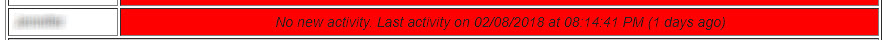
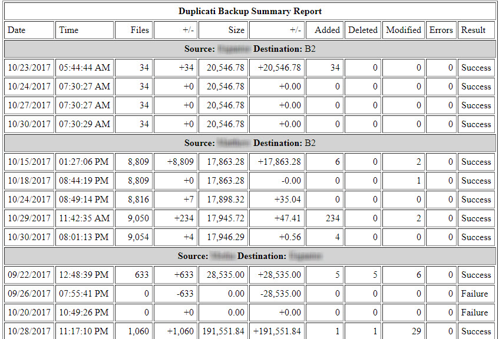
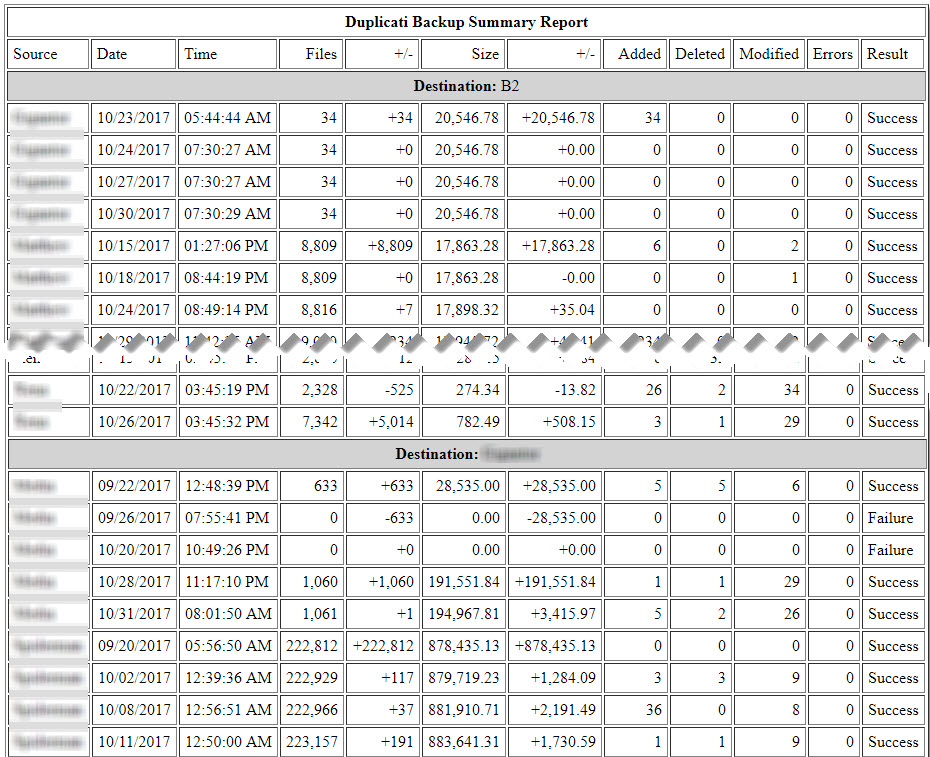
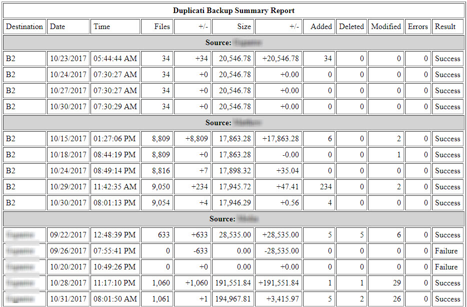
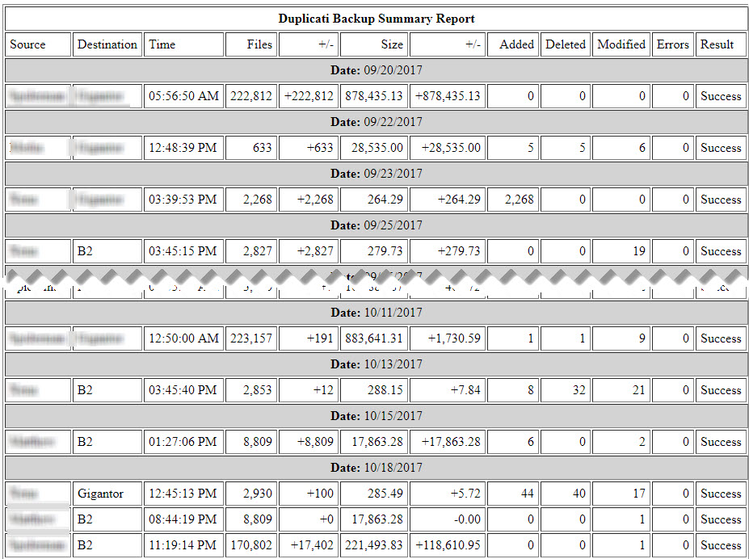

# WELCOME TO dupReport!!!

dupReport is an email-based reporting system for Duplicati. It will gather all your Duplicati backup status emails and produce a summary report on what Duplicati backup jobs were run and their success or failure.

## Available Code Branches

Beginning with release 2.1, the branch structure of the dupReport repository has changed. We have moved to a more organized structure based on [this article by Vincent Driessen](http://nvie.com/posts/a-successful-git-branching-model/) (with some modifications). (Thanks to @DocFraggle for suggesting this structure.)

There are only two generally-available branches in the dupReport repository:

| Branch Name  | Current Version | Purpose                                                      |
| ------------ | --------------- | ------------------------------------------------------------ |
| **master**   | 2.2.1           | This is the Release branch, which should contain <u>completely stable</u> code. If you want the latest and greatest release version, get it here. If you are looking for an earlier release, tags in this branch with the name "Release_x.x.x" will point you there. |
| **pre_prod** | \<None\>        | The Pre-Production branch. This is a late-stage beta branch where code should be mostly-stable, but no guarantees. Once final testing of code in this branch is complete it will be moved to master and released to the world. If you want to get a peek at what's coming up in the next release, get the code from here. **If you don't see a pre_prod branch in the repository, that means there isn't any beta code available for testing.** |

If you see any additional branches in the repository, they are there for early-stage development or bug fix testing purposes. Code in such branches should be considered **<u>highly unstable</u>**. Swim here at your own risk. Void where prohibited. Batteries not included. Freshest if eaten before date on carton. For official use only. Use only in a well-ventilated area. Keep away from fire or flames. May contain peanuts. Keep away from pets and small children. (You get the idea.)

Bug reports and feature requests can be made on GitHub in the [Issues Section](https://github.com/HandyGuySoftware/dupReport/issuesdupReport). <u>Please do not issue pull requests</u> before discussing any problems or suggestions as an Issue. 

The discussion group for dupReport is on the Duplicati Forum in [this thread](https://forum.duplicati.com/t/announcing-dupreport-a-duplicati-email-report-summary-generator/1116).

The program is released under an MIT license. Please see the LICENSE file for more details.

Please follow dupReport on Twitter [@dupReport](https://twitter.com/DupReport)

Enjoy!

# What is it?

dupReport is a program that will collect up status emails from Duplicati and combine them into a single email report that is sent to you. The following diagram helps explain how it works:

\

Some general points about dupReport

- The program is designed for those who run backups from multiple locations and are getting multiple     Duplicati emails per day. For example, we have 14 separate emails coming in per day from Duplicati backup jobs; way too many to keep track of manually. In these cases, dupReport will collect and collate all those emails and create a single report that summarizes all of them. If you only have a single instance of Duplicati running a single backup job, you may get some value from dupReport, but it may be overkill.
- dupReport doesn’t interface directly with Duplicati and doesn't read the Duplicati configuration files, log files, or or database. It connects to your email server, reads the backup report emails that Duplicati sends out, then parses them to create its report. It does not need to be run on the same system where Duplicati is running, it can be on a completely different system if that is more convenient for you. The only requirement is that the system where dupReport is running must be able to connect to your email server.

# Origin Story

The old CrashPlan Home backup system had a really nice feature whereby it would gather up the current backup status for all your systems and mail you a consolidated report on a periodic basis. It was a great way to make sure all your backups were current and to notify you if something was wrong. Duplicati has no such capability. You can configure it to send you email when backup jobs completed, but you get a separate email for each backup job that runs. In the configuration we have (9 systems backing up to 2 different storage services in various combinations) we get 14 different emails per day. Compare that with CrashPlan's single summary email per day and you can see how this was a problem. Others on the [Duplicati discussion forum](https://forum.duplicati.com/) noticed it, too. That started us thinking about developing a tool to provide summarized email notification for Duplicati users.  

dupReport was born.  

# Source-Destination Pairs

dupReport identifies backup jobs as a series of "Source-Destination" pairs. dupReport uses Source-Destination Pairs to identify the source and destination systems for each backup job. The default dupReport configuration requires that jobs be named in a way that indicates what is being backed up and where it is going. For instance, a job named: “Fred_Home_Desktop-Homers_Minio would show up in the dupReport as:

> **Source:** Fred_Home_Desktop   **Destination:** Homers_Minio

Note that spaces in job names are not supported, at least by the default pattern matching.

Source-Destination pairs are specified in dupReport in the following format: 

```
<Source><delimiter><Destination>
```


Where:

- \<Source\> is a series of alphanumeric characters
- \<delimiter\> is a single character (typically one of the "special" characters) and **CAN NOT** be a character you use in any of your Source-Destination pairs 
- \<Destination\> is a series of alphanumeric characters
- **There can be NO SPACES** in or between the \<Source>, \<delimiter>, and \<Destination> specifications

dupReport allows you to define the format specification of the Source, Destination, and Delimiter in the [main] section of the dupReport.rc file. Each specification is the regular expression definition of that element. The defaults are: 

```
[main]
srcregex=\w\*
destregex=\w\*
srcdestdelimiter=-
```

Together the full source-destination regex is:

```
<srcregex><srcdestdelimiter><destregex> 
```

You can modify the specification of these elements by replacing each with a regular expression defining how dupReport can find that element in a email's subject line. 

***WARNING!*** *dupReport relies on the Source-Destination pair format for all of its operations. If you do not properly specify your Source-Destination pair formats in both the program (through the dupReport.rc file) and in Duplicati (through proper job naming) none of this will work for you. In particular (and repeating what's already been stated) make sure that you **DO NOT INCLUDE ANY SPACES** in or between the \<Source>, \<delimiter>, and \<Destination> specifications in your Duplicati job names.*

# Identifying Emails of Interest

dupReport scans the identified mailbox looking for backup job emails. However, there may be hundreds (or thousands) of emails in the inbox, only a few of which contain information about Duplicati backup jobs. dupReport identifies "Emails of Interest" by matching the email's subject line against a pattern defined in the dupReport.rc file. If the pattern matches, the email is analyzed. If the pattern does not match, the email is ignored. 

The default pattern it looks for is the phrase "Duplicati backup report for" which is the default used  for Duplicati's “send-mail-subject” advanced option. You can change the text that dupReport tries to match by adjusting the subjectregex= option in the [main] section of the dupReport.rc file. subjectregex is  the regular expression definition for the desired phrase. The default for this option is: 

```
[main]
subjectregex=^Duplicati Backup report for 
```

If you change the subjectregex option, be sure that it will match the text specified in the Duplicati send-mail-subject advanced option or you will not be able to properly match incoming emails.

Several users on the Duplicati Forum have found different ways to modify subjectregex= to get more control over finding Emails of Interest. [This idea from dcurrey](https://forum.duplicati.com/t/announcing-dupreport-a-duplicati-email-report-summary-generator/1116/15) shows one way to specify what types of report emails you are looking for.  [This post from Marc_Aronson](https://forum.duplicati.com/t/how-to-configure-automatic-email-notifications-via-gmail-for-every-backup-job/869) shows another approach.

# System Requirements

dupReport has been formally tested on Linux (Debian 8) and Windows 10 and is officially supported on those platforms. However, users posting on the [dupReport announcement page on the Duplicati Forum](https://forum.duplicati.com/t/announcing-dupreport-a-duplicati-email-report-summary-generator/1116)   have stated they’ve installed and run the program on a wide variety of operating systems. The python code uses standard Python libraries, so it *should* run on any platform where Python can be run. *Should*.

In addition to the dupReport program files, the only other software dupReport needs is Python3. Installation instructions for Python are beyond our scope here, but instructions are widely available on the Internet.

# Installing dupReport

dupReport installation is easy and quick. To begin, download the dupReport files from the GitHub repository and place them in the directory of your choice. Then, make sure Python 3 is installed on your system and operating correctly.

## First-time Installation

Installing dupReport is easy. To use all the default values, execute the following command:

```
Linux systems: user@system:~$ /path/to/dupReport/dupReport.py
```

```
Windows Systems: C:\users\me> python.exe \path\to\dupreport\dupReport.py
```

dupReport is self-initializing, in that running the program for the first time creates the database, initializes the .rc file with a bunch of default values, then exits. By default, the database and .rc files will be created in the same directory where the dupReport.py script is located. If you want them created in another location use the following program options:

```
dupReport.py -r <RC_Directory> -d <Database_Directory>
```

dupReport will create the .rc and database files in their respective paths. Both directories must already exist and you must have read and write access permissions to those locations. Use of the default values for these file paths is recommended, but the option is there if you want it.

The only thing dupReport can't set defaults for is the technical specifics about your incoming and outgoing mail servers (for example, the name/IP address, user ID, password, transport, encryption, etc.). These are specified in the [incoming] and [outgoing] sections of the .rc file. Once you edit those entries in the .rc file everything should work like magic. Probably.

More information on the .rc file configuration can be found below under “RC File Configuration.”

## Upgrading From a Previous Version

If you have been running an earlier version of dupReport, the program will automatically update the dupReport.rc file and the dupReport.db database to the latest versions. Depending on the extent of the changes, the program may indicate that you need to edit the dupReport.rc file to set any new options correctly. 

As a precaution, **it is highly recommended that you backup your .rc and .db files to a safe place** before proceeding with the upgrade until you're sure everything is working properly.

## Running the Program After Installation

Once all the options have been set in the .rc file, use the following commands to run dupReport normally:

```
Linux systems: user@system:~$ /path/to/dupReport/dupReport.py <options>
```

```
Windows Systems: C:\users\me> python.exe \path\to\dupreport\dupReport.py <options>
```

# Command Line Options

Command line options alter the way dupReport operates. Many command line options have equivalent options in the dupReport.rc file. If an option is specified on both the command line and in the .rc file, the command line option takes precedence.

dupReport has the following command line options:

| Short Version               | Long Version                      | Description                              |
| --------------------------- | --------------------------------- | ---------------------------------------- |
| -h                          | --help                            | Display command line options.            |
| -r \<rcpath\>               | --rcpath \<rcpath\>               | Sets \<rcpath\> as the directory where the dupReport.rc file is located. \<rcpath\> should point to the directory only, not a full file path specification. |
| -d \<dbpath\>               | --dbpath \<dbpath\>               | Sets \<dbpath\> as the directory where the dupReport.rc file is located. Overrides the [main] dbpath= option in dupReport.rc file. \<dbpath\> should point to the directory only, not a full file path specification. |
| -l \<logpath\>              | --logpath \<logpath\>             | Sets \<logpath\> as the directory where the dupReport.log file is located. Overrides the [main] logpath= option in dupReport.rc file. \<logpath\> should point to the directory only, not a full file path specification. |
| -v {0,1,2, 3}               | --verbose {0,1,2, 3}              | Sets the verbosity of the information in the log file. 1=General program execution info. 2=Program flow and status information. 3=Full debugging output |
| -a                          | --append                          | Append new logs to existing log file. Overrides [main] logappend= in dupReport.rc file. |
| -s {‘byte’, ‘mega’, ‘giga’} | --size {‘byte’, ‘mega’, ‘giga’}   | Display file sizes in bytes, megabytes, or gigabytes |
| -i                          | --initdb                          | Erase all information from the database and resets the tables. |
| -c                          | --collect                         | Collect new emails only and don't run summary report. -c and -t options can not be used together. |
| -t                          | --report                          | Run summary report only and don't collect emails. -c and -t options can not be used together. |
| -b \<DateTimeSpec>          | --rollback \<DateTimeSpec>        | Roll back database to a specified date and time, then continue processing emails. \<DateTimeSpec\> must be in the following format: “\<datespec> \<timespec>”, where \<datespec> and \<timespec> are in the same format specified by the “dateformat=” and “timeformat=” options specified in the [main] section of the dupReport.rc file. For example, if dateformat="MM/DD/YYYY" and timeformat="HH:MM:SS" \<DateTimeSpec> should be set to "12/17/2017 12:37:45". See the discussion of the dateformat= and timeformat= options below. To roll back the database to the beginning of a day, use "00:00:00" for \<timespec>. |
| -B \<DateTimeSpec>          | --rollbackx \<DateTimeSpec>       | Roll back database to a specified date and time. Same operation as -b, except program will exit after rolling back the database. |
| -f \<filespec\>,\<type\>    | --file \<filespec\>,\<type\>      | Send the report to a file in text, HTML, or CSV format. -f may be used multiple times to send the output to multiple files. \<filespec\> can be one of the following: A full path specification for a file; 'stdout', to send to the standard output device; 'stderr', to send to the standard error device. \<type\> can be one of the following: “Txt”, “Html”, or “csv” |
| -x                          | --nomail                          | Do not send the report through email. This is typically used in conjunction with the -f option to save the report to a file rather than send it through email. |
| -m \<source> \<destination> | --remove \<source> \<destination> | Remove a source-destination pair from the database. |
| -p                          | --purgedb                         | Purge emails that are no longer on the server from the database. Overrides [main] purgedb in .rc file. |
| -w                          | --stopbackupwarn                  | Suppress sending of unseen backup warning emails. Overrides all "nobackupwarn" options in the .rc file. See description of nobackwarn= option in "[source-destination] Sections" below. |


# dupReport.rc Configuration

The dupReport.rc file contains configuration information for dupReport to run properly. Many options in the dupReport.rc file have equivalent command line options. If an option is specified on both the command line and the .rc file, the command line option takes precedence.

## [main] section

The [main] section contains the high-level program options for dupReport to run properly.

```
version=<major>.<minor>.<subminor>
```

The current version number of the program. Used to determine if the .rc file needs to be updated. **PLEASE DO NOT** alter the version= option

```
dbpath=<dbpath>
```

 Directory where the dupReport.db file is located. Can be overridden by the -d command line option.

```
logpath=<logpath> 
```

The directory where the dupReport.log file is located. Can be overridden by the -l command line option.

```
verbose=
```

- 0=No log output
- 1=(Default) General program execution info.
- 2=Program flow and status information
- 3=Full debugging output

Sets the level of detail the program will put in the log file. Can be overridden by the -v command line option.

```
logappend=false
```

Append new logs to the log file (true) or reset log file for each run (false). Can be overridden by the -a command line option.

```
subjectregex=^Duplicati Backup report for
```

A regular expression used to find backup message Emails Of Interest. This should somewhat match the text specified in the ‘send-mail-subject’ advanced option in Duplicati.

```
srcregex=\w*
```

Regular expression used to find the “source” side of the source-destination pair in the subject line of the email.

```
destregex=\w*
```

Regular expression used to find the “destination” side of the source-destination pair in the subject line of the email.

```
srcdestdelimiter=-
```

Single character used to specify the delimiter between the ‘source’ and ‘destination’ parts of the source-destination pair.

```
dateformat=MM/DD/YYYY
```

Default format for dates found in emails. Acceptable formats are:

- MM/DD/YYYY
- DD/MM/YYYY
- MM-DD-YYYY
- DD-MM-YYYY
- MM.DD.YYYY
- DD.MM.YYYY
- YYYY/MM/DD
- YYYY/DD/MM
- YYYY-MM-DD
- YYYY-DD-MM
- YYYY.MM.DD
- YYYY.DD.MM

If there are problems in your report dates (especially if your locale doesn't use U.S.-style dates), or if you are getting program crashes around the date/time routines, you might try checking and/or changing this value.

The default format can be overridden for specific backup jobs by specifying a dateformat= line in a job-specific section of the .rc file. See “[source-destination] Sections” below.

```
timeformat=HH:MM:SS
```

Default format for times found in emails. The only time format currently acceptable is ‘HH:MM:SS’. The default format can be overridden for specific backup jobs by specifying a timeformat= line in a job-specific section of the .rc file. See “[source-destination] Sections” below.

```
warnoncollect=false
```

If true, send an email if there are warning or error messages in incoming email. Only works if the -c option is specified so the user will get error messages even if they are not producing an email report.

```
applyutcoffset=true
```

Duplicati version 2 does not apply local time zone information when reporting start and end times for backup jobs. If set to 'true', this option takes the UTC time zone offset from the email header and applies it to the backup job start and end times. If the backup times in your report do not look right, try adjusting this value.

```
show24hourtime=false
```

 If true, times will be displayed in 24-hour notation. Otherwise, dupReport will use 12-hour, AM/PM notation.

```
purgedb=true
```

If true, emails in the database that are no longer found on the incoming email server will be purged from the database and the database will be compacted. **NOTE:** Any source-destination pairs referenced in purged emails will remain in the database in case emails for those pairs are seen in the future. To remove obsolete source-destination pairs from the database, use the -m option.

```
showprogress=0
```

If this option is greater than zero, dupReport will display a dot ('.') on stdout for every 'n' emails that are processed from the incoming server. For example, if showprogress=5, there will be one '.' for every 5 emails that are read.

## [incoming] section

The [incoming] section contains settings for incoming email that dupReport reads to create the report. 

```
transport=imap
```

 Specify the transport mechanism used to gather emails from the email server. Can be 'imap' or 'pop3'. IMAP is *highly* recommended.

```
inserver=localhost
```

DNS name or IP address of email server where Duplicati result emails are stored. 

```
inport=995
```

IMAP or POP3 port for incoming email server. 

```
inencryption=tls
```

Specify encryption used by incoming email server. Can be 'none', 'tls' (default), or 'ssl'

```
inaccount=<account_name>
```

User ID on incoming email system

```
inpassword=<password>
```

Password for incoming email system

```
infolder=INBOX
```

Email account folder where incoming Duplicati email is stored. This parameter is used for IMAP systems and ignored for POP3 systems.

```
inkeepalive=false
```

Large inboxes may take a long time to scan and parse, and on some systems this can lead to a server connection timeout before processing has completed. This is more likely to happen on the outgoing connection (where there may be long periods of inactivity) than on the incoming connection. However, if you are experiencing timeout errors on your incoming server connection set this value to 'true'.

## [outgoing] section

The [outgoing] section contains settings for the email server that dupReport will use to send the final summary report email. 

```
outtransport=smtp
```

Specify the transport protocol used to send emails to the outgoing server. Only SMTP is supported for outgoing email.

```
outserver=localhost
```

DNS name or IP address of outgoing email server. 

```
outport=587
```

SMTP port for outgoing email server. 

```
outencryption=tls
```

Specify the encryption used by outgoing email server. Can be 'tls' or 'none'

```
outaccount=<account name>
```

User ID on outgoing email system.

```
outpassword=<password>
```

Password for outgoing email system.

```
outsender=sender@somemail.com
```

Email address of report sender. To add a "friendly name" to the sender's email address, use the form:

​	 `outsender=Arthur Dent <adent@galaxy.org>`

```
outreceiver=receiver@somemail.com
```

Email address of report recipient. To add a "friendly name" to the receiver's email address, use the form:

​	`outreceiver=Arthur Dent <adent@galaxy.org>`

To send to multiple recipients, separate the recipients with a comma:

​	`outreceiver=adent@galaxy.org, Zaphod B <zbeeblebrox@galaxy.org>`

```
outkeepalive=false
```

Large inboxes may take a long time to scan and parse, and on some systems this can lead to a server connection timeout before processing has completed. This is more likely to happen on the outgoing connection (where there may be long periods of inactivity) than on the incoming connection. If you are experiencing timeout errors on your outgoing server connection set this value to 'true'.

## [report] section

The [report] section contains settings for the final report created by dupReport.

```
style=srcdest
```

Specifies the type of report for dupReport to create. Allowable report styles are:

- **srcdest**: Backup jobs grouped by source-destination pairs
- **bydest**: Backup jobs grouped by destination systems
- **bysource**: Backup jobs grouped by source systems
- **bydate**: backup jobs grouped by run date

See “Report Formats” below for more information on reporting formats and options.

```
sortby=source
```

Specify how to sort the data within the report specified by the style= parameter

Allowable sorting options are:

- **srcdest**: 'source' or 'destination'
- **bydest**: 'source' or 'date'
- **bysource**: 'destination' or 'date'
- **bydate**: 'source', 'destination', or 'time'

```
reporttitle=Duplicati Backup Summary Report
```

Main report tile used for the report.

```
subheading=Report Subheading
```

Text to use as the subheading of the report. Because the subheading is different for each report there is no default for this option and <u>you will need to manually add it to the .rc file to enable it</u>. If a subheading is not specified in the .rc file, dupReport will supply the following default subheading:

| Report   | Default Subheading                       |
| -------- | ---------------------------------------- |
| srcdest  | Source: \<source>  Destination: \<destination> |
| bydest   | Destination: \<destination>              |
| bysource | Source: \<source>                        |
| bydate   | Date: \<date>                            |

**Keyword Substitution**: You can supply keywords within the subheading= option to customize the way it looks. Available keywords are:

- \#SOURCE#: Inserts the appropriate source name in the subheading
- \#DESTINATION#: Inserts the appropriate destination name in the subheading
- \#DATE#: Inserts the appropriate date in the subheading

For example, in the srcdest report an appropriate subheading might be:

```
subheading = Source System: #SOURCE# Destination System: #DESTINATION#
```

For the bydest report an appropriate subheading might be:

```
subheading = Target Destination: #DESTINATION#
```

Not all keywords are appropriate for all reports. The following table shows what keywords are available to use in the subheading field for each report:

| Report   | Allowable Keywords        |
| -------- | ------------------------- |
| srcdest  | \#SOURCE#  \#DESTINATION# |
| bydest   | \#DESTINATION#            |
| bysource | \#SOURCE#                 |
| bydate   | \#DATE#                   |

```
border=1
```

Size in pixels of the borders in the report table. (HTML only)

```
padding=5
```

Size of cell padding in the report table. (HTML only)

```
displaymessages=false
```

Display any informational messages contained in the Duplicati email. Default is false

```
displaywarnings=true
```

Display any warning messages contained in the Duplicati email. Default is true

```
displayerrors=true
```

Display any error messages in the Duplicati email. Default is 'true'

```
sizedisplay=byte
```

Display file sizes in bytes, megabytes, or gigabytes. Can be overridden by the -s option on the command  line. Default is 'byte'

```
showsizedisplay=true
```

Determine whether to show the size indicator ('MB' or 'GB') in the size columns.

```
repeatheaders=true
```

Indicates whether to repeat the column headers for each report section (true) or only at the beginning of the report (false). Default is 'false'

```
titlebg=#FFFFFF
```

Background color for report title. (HTML only)

```
subheadbg=#D3D3D3
```

Background color for report subheadings. (HTML only)

```
noactivitybg=#FF0000
```

**DEPRECATED as of version 2.2.0.**  This option is no longer referenced in the code and will be removed from the .RC file if found. It has been replaced by the [report] lastseen* set of options. See that description for information on how those options work. 

```
jobmessagebg=#FFFFFF
```

Background color for job messages. (HTML only)

```
jobwarningbgDefault=#FFFF00
```

background color for job warning messages. (HTML only)

```
joberrorbg=#FF0000
```

HTML background color for job error messages. (HTML only)

```
nobackupwarn=5
```

Sets the threshold of the number of days to go without a backup from a source-destination pair before sending a separate email warning. If nobackupwarn is set to 0 no email notices will be sent. The warning email will be sent to the email address specified by the "outreceiver" option in the [outgoing] section unless overridden by a "receiver=" option in a [source-destination] section. 

```
nbwsubject = Backup Warning: #SOURCE##DELIMITER##DESTINATION# Backup Not Seen for #DAYS# Days
```

If the threshold defined by nobackupwarn is reached, the string specified by nbwsubject will be used as the subject of the warning email. This can be overridden on a per backupset basis by adding a nbwsubject= option in a [source-destination] section. 

**Keyword Substitution**: You can supply keywords within the nbwsubject option to customize the way it looks. Available keywords are: 

- \#SOURCE# - The source in a source-destination pair
- \#DESTINATION# - The destination in a source-destination pair
- \#DELIMITER# - The delimiter used in a source-destination pair (specified in [main] srcdestdelimiter)
- \#DAYS# - The number of days since the last backup
- \#DATE# - The date of the last backup
- \#TIME# - The time of the last backup

```
lastseenlow= 5
lastseenmed = 10
lastseenlowcolor = #FFFF00
lastseenmedcolor = #FF4500
lastseenhighcolor = #FF0000
```

These options set parameters for displaying "Last Seen" lines in the email report and the optional "Last Seen" Summary table (discussed below). If a known backup set was not seen during the program's run the following line will be added to the result email:



lastseenlow= and lastseenmed= set thresholds for displaying the number of days since a backup has been seen. The lastseen*color= options set background colors for the display. The following chart shows how the thresholds and colors work:

| Comparison                                   | Background Color Display (HTML only)   |
| :------------------------------------------- | :------------------------------------- |
| \# days <= 'lastseenlow'                     | lastseenlowcolor (Defaut: yellow)      |
| \# days > 'lastseenlow' and <= 'lastseenmed' | lastseenmedcolor (Default: orange-red) |
| \# days > 'lastseenmed'                      | lastseenhighcolor (Default: red)       |

```
lastseensummary = none
lastseensummarytitle = Backup Sets Last Seen
```

Add a summary table of all the backup sets and the date they were last seen by dupReport to the final report. An example of the table looks like this:


The default option is 'none' to skip this table. 'top' puts the table at the top of the summary report, 'bottom' places it at the bottom of the summary report. The lastseensummarytitle= option sets a custom title for the table.

### **Report color selection:** 

All color specifications in the [report] section follow standard HTML color codes. For a sample list of colors and their HTML codes, please refer to [https://www.w3schools.com/colors/colors_names.asp](https://www.w3schools.com/colors/colors_names.asp)

## [headings] section

The [headings] section contains the default column titles for the fields used in all the dupReport reports. You can alter the headings to suit your tastes. For example, to change the heading for the “size” column from “Size” to “How Big?”, change this:

```
size = Size
```


to this:

```
size = How Big?
```


Once this change is made, any report that displays the “size” column will display the text “How Big?” as the column header.

To prevent a field from displaying on a report, leave the heading specification blank for that field. For example, to prevent the “added” field from displaying on a report, change its line in the [headings] section to:

```
added =
```

| Heading Field    | Notes                                    |
| ---------------- | ---------------------------------------- |
| source           | The source system for the backup         |
| destination      | The destination system for the backup    |
| date             | The date of the backup                   |
| time             | The time of the backup                   |
| files            | Number of files examined by the backup job |
| filesplusminus   | The increase (+) or decrease (-) in the number of files examined since the previous backup |
| jobsize          | The total size of the files examined by the backup |
| jobsizeplusminus | The increase (+) or decrease (-) in the total size of files examined since the previous backup job |
| added            | Number of blocks added to the backup     |
| deleted          | Number of blocks deleted from the backup |
| modified         | Number of blocks modified by the backup  |
| errors           | Number of errors encountered during the backup |
| result           | The final result of the backup job (e.g., Success, Failure, etc) |
| jobmessages      | Messages generated by the backup job during its run. This column can also be suppressed by setting displaymessages=false in the [report] section. |
| jobwarnings      | Warning messages generated by the backup job during its run. This column can also be suppressed by setting displaywarnings=false in the [report] section |
| joberrors        | Error messages generated by the backup job during its run. This column can also be suppressed by setting displayerrors=false in the [report] section |

## [source-destination] sections

Specific options can also be set for each Source-Destination pair in the system. For example, to specify parameters specifically for a backup job named “Client-Server”, there should be a section in the .rc file with the following name:

```
[Client-Server]
```

Note that the section name must match the Source-Destination pair name ***exactly***, including capitalization and delimiter characters. If there is any difference between the Source-Destination job name and the [source-destination] section name, the program will not be able to match the proper parameters to the correct backup job.

Because [source-destination] sections are optional, they must be manually added to the .rc file if they are needed. 

The options currently recognized in the [source-destination] section are:

```
dateformat=
timeformat=
```

The allowable values for these options are the same as the dateformat= and timeformat= options in the [main] section. Specifying date and time formats on a per-job basis allows the program to properly parse and sort date and time results from backups that may be running in different locales and using different date/time display formats. If any of these options are not specified in a [source-destination] section the following fallback options will be used:

| Option      | Fallback Option    |
| ----------- | ------------------ |
| dateformat= | [main] dateformat= |
| timeformat= | [main] timeformat= |

**NOTE:** dateformat= and timeformat= in a [source-destination] section are only applied to the parsing of *incoming* emails. Dates and times produced in the final report are always formatted according to the default dateformat= and timeformat= options in the [main] section.

```
nobackupwarn = 3
nbwsubject = BACKUP WARNING: #SOURCE##DELIMITER##DESTINATION# not being backed up!
receiver = person@mailserver.com
```

These options specify the parameters for warning emails if a backup has not been seen for a period of time. See the descriptions for the [report] section above for allowable values for these options. If any of these options are not specified in a [source-destination] section the following fallback options will be used:

| Option      | Fallback Option         |
| ----------- | ----------------------- |
| nobackwarn= | [report] nobackupwarn=  |
| nbwsubject= | [report] nbwsubject=    |
| receiver=   | [outgoing] outreceiver= |

```
offline = True
```

This suppresses mention of the source-destination pair in the output report. Useful when you know a system is going to be offline for a while and you don't want to see the "not seen in X days" warning message in the report.

# Report Formats

dupReport has several formats for reporting that are specified in the “style” parameter in the [report] section of the dupReport.rc file. Each report can be sorted in various ways. Sorting options are configured using the “sortby” option in the [report] section.

------

**The ‘srcdest’ report**, also known as the “classic” report, displays backup jobs in groups of Source-Destination pairs. Here is an example of the ‘srcdest’ report:




------

**The 'bydest' report** displays backup jobs grouped by destination. Here is an example of the ‘bydest’ report:




------

**The ‘bysource’ report** displays backup jobs grouped by source. Here is an example of the ‘bysource’ report:




------

**The ‘bydate’ report** displays backup jobs grouped by the date the jobs were run. Here is an example of the ‘bydate’ report:



